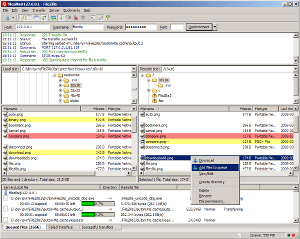

File protocol: FTP

Host name : privftp.pro.proxad.net

Port number: 21

User name: wad24@if3projets.net

Password: If3wad24&If3wad24

 

Les logiciels à installer pour la mise en ligne :
soit Filezilla https://filezilla-project.org/,
soit WinSCP https://winscp.net  -  https://winscp.net/eng/download.php

 

    FILEZILLA 

https://filezilla-project.org/

 

FileZilla is a free FTP solution that not only supports FTP but also FTP over TLS (FTPS) and SFTP.

Download FileZilla Client for Windows (64bit x86)

Screenshot

The latest stable version of FileZilla Client is 3.68.1

Please select the file appropriate for your platform below.

Windows (64bit x86) Operating system logo

Download
FileZilla Client
This installer may include bundled offers. Check below for more options.

The 64bit versions of Windows 8.1, 10 and 11 are supported.

Download FileZilla Client for Windows (64bit x86)

WinSCP https://winscp.net

https://winscp.net

 
 

Official Site :: Free SFTP and FTP client for Windows - WinSCP

 

WinSCP is a popular SFTP client and FTP client for Microsoft Windows! Copy file between a local computer and remote servers using FTP, FTPS, SCP, SFTP, WebDAV or S3 file transfer protocols . Download Now

    Download 

WinSCP 6.3 is a major application update. New features and enhancements include: Single large file can be downloaded using multiple SFTP connections. Support for OpenSSH certificates for host verification. File hash can be used as criterion for synchronization. Improved behavior when duplicating and moving remote files.

    Documentation 

Documentation - Official Site :: Free SFTP and FTP client for Windows - WinSCP

    News 

WinSCP 6.4 is a major application update. New features and enhancements include: Thumbnail view in file panels. Three selectable sizes of toolbar icons, showing slightly larger size by default. Optimized working with large local directories. Dark theme for session tabs. Improvements to AWS/S3 authentication and configuration handling.

    Introduction 

WinSCP is an open source free SFTP client, FTP client, WebDAV client, S3 client and SCP client and file manager

 

https://winscp.net/eng/download.php

