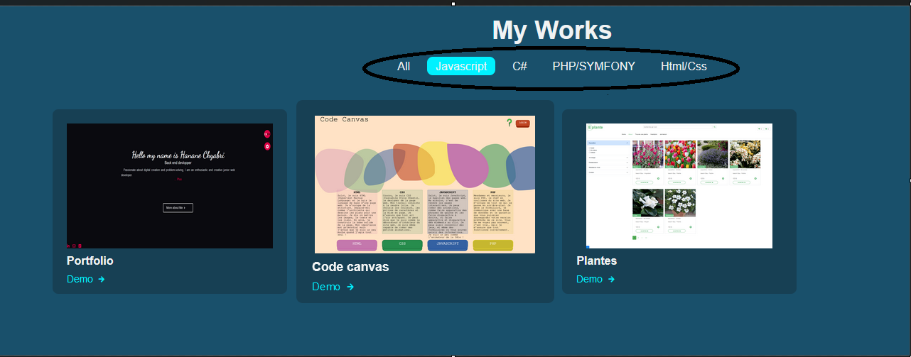
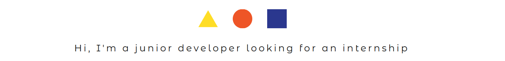

# Portfolio Jenny Fernandez Garcia

Portfolio réalisé dans le cadre des cours d'architecture et ergonomie d'un site web. 

## Analyse / Audit

### Objectif

Présenter mon profil / Cv sous forme de site web afin d'attirer l'attention de futurs employeurs sur mon profil et mes compétences Web et gestion de projets.

### Public visé

Futurs employeurs et /ou lieux de stage

### Slogan

Jenny Fernandez Garcia - Web Developer Junior

### Perspectives

Carte de visite dans ma recherche "passive" d'emploi

### Interlocuteurs

- Nicole Lenoir: responsable du suivi des projets
- Jury: responsable de la validation du projet

### Langues

J'ai choisi de le rédiger en **Français** et en **Anglais**. Il y aura donc une landing Page où il sera possible de choisir la langue du site. Il y aura également une icone dans la barre de navigation permettant de changer de langue sur n'importe quelle page. 

### Inspirations

1. Hanane\
Lien: http://www.if3projets.net/wad23/hanane/

    • J’aime la possibilité de filtrer les différents projets
    • J’aime cette typo 
    • J’adore la couleur du fond
    
    

2. Senem\
Lien: http://www.if3projets.net/wad23/senem/apropros.html

    • J’aime le titre qui bouge
    • Les menus latéraux
    • L’aspect terminal

    

3. Yusra\
Lien: http://www.if3projets.net/wad23/yusra/#cont
    • J’aime l’avatar
    

4. Camille\
Lien: http://www.if3projets.net/wad22/camille/
    • J’aime l’aspect ligne du temps pour l’XP
    • J’aime l’aspect dessiné des illus

    
    

5. Maya\
        Lien: http://www.if3projets.net/wad22/maya/
        • J’aime l’animation d’accueil
        

6. Menen\
Lien: http://www.if3projets.net/wad22/menen/
    • J’aime cette couleur de fond : #f4ebd0

7. Sara\
Lien: http://www.if3projets.net/wad22/sara/
    • J’aime la typo (font-anim), me donne envie de trouver des typos de jeux de société bien connus / disney.

8. Thao\
Lien: http://www.if3projets.net/wad20/thao/
    • J’aime la présentation en hexagones (me fait penser à des tuile de jeu)
    

9. Kelly\
Lien: http://www.if3projets.net/wad20/kelly
    • J’aime le déplacement et la transition entre les pages (diagonale)

10. Libellud\
Lien: https://www.libellud.com/univers-dixit/ (mon site préféré)
    • J’adore l’univers et les illus
    • Je souhaite reprendre l’idée des cartes pour les différentes rubriques
        
    
    • J’aime l’effet de fondu entre les différentes sections
        
    
    • J’aime le mélange entre le contenu fixe et certains éléments animés
        

12. Animations\

- Titres
https://graphiste.com/blog/30-animations-de-texte-pour-surprendre-vos-visiteurs/

- Images
https://blog.hubspot.fr/website/animation-css
https://web-eau.net/blog/15-animations-css-vraiment-bluffantes
https://graphiste.com/blog/animations-css/

- Au scroll
https://michalsnik.github.io/aos/
https://www.youtube.com/watch?v=wKkFh6O9A0M

- Transition pages

Ici j'aime l'effet radial clip
https://www.sliderrevolution.com/resources/css-page-transitions/

- Création avatars
https://notion-avatar.vercel.app/
avataaars.com
https://readyplayer.me/fr/hub

## Conception du site

### Elements à mettre en place

1. Architecture\
    Il s'agit d'un site multipages qui sera dans les 2 langues (FR et EN). Il y aura 10 pages/ langue. 
2. Menu\
Il y aura un menu de **navigation vertical** (centre gauche) afin de laisser un maximum de place au contenu de la page. En haut de ce menu il y aura un menu burger rétractable qui permet d'afficher les différentes rubriques du site à l'horizontal (haut) afin de faciliter la navigation. 

3. Couleurs\
Voici les couleurs que j'ai choisi. Je jouerai également avec des effets de transparence pour certains éléments (cartes, menus, landingpage)

Le fond sera bleu, le menu gris et les polices seront blanches ou noires en fonction du meilleur contraste. Certains éléments du site auront une touche de crème, mais très peu car il y aura déjà pas mal d'illustrations.
Je vais voir avec plusieurs tests et les illus si un fond blanc ne serait pas plus approprié, ne gardant le fonc bleu que pour certaines pages, plus "calmes".   

4. Police\
Je vais utiliser une police d'ensemble pour les parties "pro" du site et les menus. Je vais prendre des polices différentes en fonction des rubriques choisies, pour accentuer le fait qu'entrer dans une rubrique, c'est entrer dans un univers différent des autres. A voir lors de l'implémentation si ça ne donne pas un aspect trop chargé. La police Poppins est choisie par défaut.

 - landing page: Dancing Script (donne l'impression qu'on parle)
 - menus: Poppins : calme et lisible
 - accueil: Roboto condensed - titres et texte
 - about me: Futura STD (Scythe) - titres et texte (coin avec "Disney?)
 - studies: Herculaneum () / Augusta (kingdomino) - titres, texte en Poppins
 - work: Chippewa Falls NF (aventuriers du rail) - titres, texte en Poppins
 - Web dev et portfolio: Share Tech Mono - titres et texte
 - Contact: Roboto Condensed - titres et texte
   

5. Effets\
Etant donné qu'il y a déjà pas mal d'animations, les effets seront limités
     - hover des cartes de l'accueil
     - hover des rubriques du menu
     - animation au scroll et apparition pour les éléments du portfolio
     - au click d'une compétence: filtrage des exemples du portfolio. J'hésite à ajouter un petit texte pour expliquer mon confort, ce que j'aime avec cette technologie. 

6. Animations\
Afin de casser l'aspect statique du site, et refléter mon caractère dynamique et ludique, il y aura pas mal d'animations sur le site
    - Landing page: quand on clique sur la partie en transparence, on passe dans l'autre langue
    - Menu burger: pour faire apparaître / disparaitre le menu des rubriques horizontal
    - Les cartes de la page d'acceuil:
        * effet éventail lors du chargement de la page
        * se surélèvent et apparition du texte lors du hover sur un partie de la carte
        * lorsqu'on clique, effet fondu qui prend toute la page
    - Le bonhomme qui cherche un stage ( juste le bras avec la lanterne qui bouge)
    - illustrations donnent un effet de flottement
    - Ligne du temps: bonhomme qui monte et qui descend les chemins de montagne quand on clique sur une date + ouverture d'un pop-up avec infos complémentaires

### Fonctionnement du site et présentation du contenu

1. Landing page: choix entre Français et Anglais
2. Page d'accueil : Photo, brève description du profil et les différentes rubriques du site présentées sous forme de cartes à tirer, texte se s'affiche au hover des cartes.
    - Header avec rubriques, rétractable en menu burger (affichage que icone home et burger, au-dessus du menu latéral d'icônes).
    - Menu latéral transparent à gauche avec toutes les icones ( github, contact, changement de langue, Cv...)

3. Rubriques\
    Lorsqu'on choisit une rubrique: La carte prend toute la page et nous amène vers la page de contenu correspondant
    - **About me** : brève description de moi et mon parcours, plus mini jeux pour trouver les différents clins d'oeil aux jeux de société dans le site
    - **Contact** : formulaire de contact avec info pour recherche de stage
    - **Parcours scolaire** : ligne du temps avec un perso qui escalade une montagne (can't stop) pour aller d'un point à l'autre
    - **Experience professionnelle**: ligne du temps avec un perso qui escalade une montagne (can't stop) pour aller d'un point à l'autre. Lorsqu'on clique sur une section, un pop-up s'ouvre avec les infos complémentaires du poste
    - **Compétences en Web Dev**: les compétences web sont mises dans des tuiles en forme d'écailles de serpent (snake - akropolis). lorsqu'on clique dessus on arrive sur la liste filtrée des projets
    - **Portfolio**: liste filtrable en fonction technologies avec les différents projets réalisés

4. Arborescence du site\

Landing page -> Accueil -> Rubriques
    - About
    - Studies
    - Work
    - Web Dev
    - Portfolio
    - Contact

### Map du site
Logiciel utilisé: Miro

[Map](<../map/Business Plan Mind Map.pdf>)

### Wireframe
Logiciel utilisé: Excalidraw
Version mobile:

Version pc: 

<!--  -->

<!--  -->
<!--  -->

### Mock-up
Logiciel utilisé: Figma
<!-- Lien vers Figma -->
https://www.figma.com/design/1y3qSGnyelCJRK5JuNG3q0/portfolio?node-id=0-1&node-type=canvas&t=uRJ1uv1OHoMZRLoZ-0

